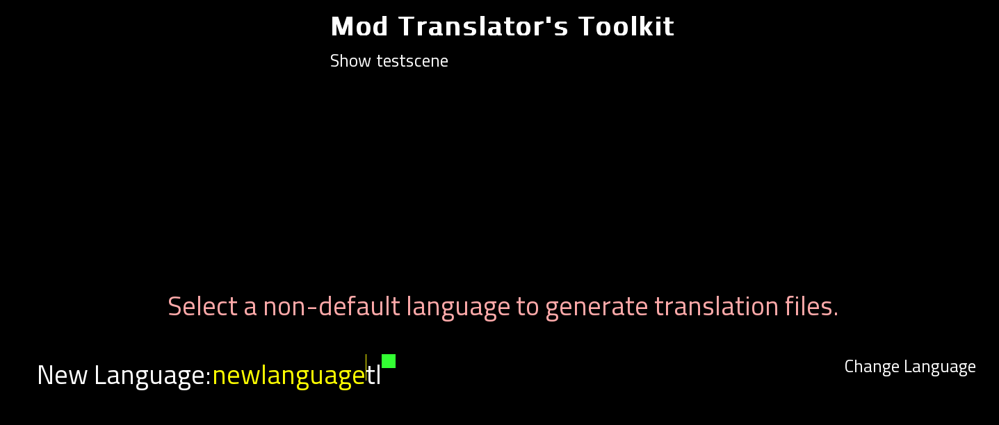
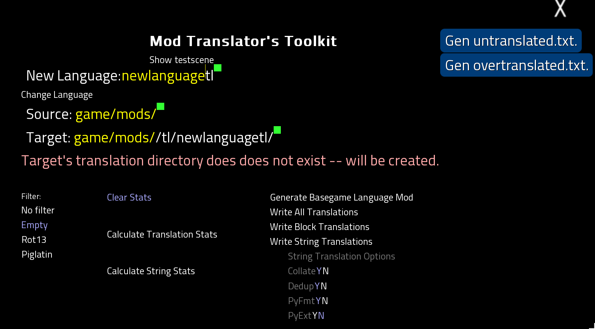

If you're looking to translate the game into a brand new language nobody has translated it to yet, you're in the right place. Congrats! I'm truly impressed by your determination. Otherwise, you may want to go back to the [main README](README.md) and follow the appropriate link.

## How do I translate the game into a new language?

First, install the Translator's Toolkit like a regular mod. I'll assume if you've come this far with the community, you already know how to do that or who to ask for help.

Second, choose English as your language and launch the game. On the main menu you'll find a new "Mod Translation" button, dead-center. Click it.

That will take you to the translation menu shown below:

Click on the yellow "newlanguagetl" text and, while hovering the mouse over the text, replace "newlanguage" with a unique, lowercase identifier for your language. This will be the folder name for your translation files. Then click "Change Language" to update the game's language setting to your new language.

The menu should refresh, taking you to this new menu:

Don't worry! This menu looks very complex, but it's built of simple parts. For now, all you need to worry about is the "Source" text box. Currently it says `game/mods/`, but you want it to pull translation lines from the base game. 

Click on the "Source" text box and, while hovering over, replace `game/mods/` with just `game/`. The square next to it should glow green both before and after you're done, though it may turn red while you're typing.

Next, we'll look at the buttons on the left, labeled "Filter." Different translators want to see different things in place of untranslated text lines when they're working, and these filters let you set what you'll see in-game. (Untranslated text lines in the text file will always be shown plain, regardless of this setting.)

The filters available as of this writing are:
* No Filter - Uses the original English text for all translation lines until you replace them with the target language.
* Blank - Uses a blank line for all translation lines until you fill them in with the target language.
* Rot13 - Uses the original English text, but ROT13-encodes it to make it appear as properly-sized gibberish until replaced with the target language translation.
* Pig Latin - Uses the original English text, but translates it into Pig Latin to make it appear as oversized gibberish until replaced with the target language translation.

Choose the filter you prefer with a click.

If you'd like to get an idea of your progress, you can click the "Calculate Translation Stats" button to see how many character-spoken text lines have been translated, and the "Calculate String Stats" button to see how many menu and interface text lines have been translated. These stats are based on the game's current language setting, so you can come back to this menu at any time to check. (Note you can also adjust the "Source" field to narrow the stats to just a single mod or part of the game.)

Finally, to create your translation mod, click "Generate Basegame Language Mod" to create a new mod folder in the `game/mods/` directory with your language identifier. This folder will contain all the translation lines from the base game, with the English text replaced by the filter you chose. You can then crack these files open and start translating!

## Advanced Options

You may have noticed the "String Translation Options" in the lower right corner of the menu. These options let you adjust the format of menu options and interface lines to better fit your needs. The options available as of this writing are:

* `Collate` (Default: Y): Collects all strings across all files into a single `strings` file. This is useful for translators who want to leave the UI text untranslated and focus on the character-spoken text, or to be able to focus on the UI-like text in one go.

* `Dedup` (Default: Y): Hides duplicate strings across _all_ files. This is useful in general to prevent duplication of work, but it's also near-mandatory if you use the Ren'Py translation format instead of the toolkit's python format, as Ren'Py will crash if it finds duplicate strings. If `Collate` is not enabled, then locations of a string outside the first file it appears in will be lost.

* `PyFmt` (Default: Y): Ignored for "Generate Basegame Language Mod." Uses the toolkit's python format for translation files. This format is slightly less human-readable than Ren'Py's format, but it's more flexible for people who want to work with the files programmatically both inside and outside the engine. If you're not sure which format to use, I recommend leaving this on. However, when making a base game language mod, this option is ignored and the Ren'Py format is used, because you _should_ be the single source of truth for the base game's translations.

* `PyExt` (Default: N): Ignored for "Generate Basegame Language Mod." Exports the strings file as `strings.py` instead of `strings.rpy`. This disables automatic loading of the strings file in Ren'Py, but it's useful for people who want to incorporate the strings file into a mod's load order. (See: [MOD_AUTHORS.md](MOD_AUTHORS.md)) For game translators, this option is disabled because a whole-game translation mod should use the Ren'Py format to ensure compatibility with the game.

Additionally, you may notice the "Target" field and "Write Translations" buttons. The "Target" field lets you set where it expects to write the translation files out. If you adjust this to read out the path to your existing language mod, then you can use the "Write Translations" buttons to _update_ your existing language mod with the new translation lines. This is useful if a mod you've translated has been updated with new text lines.