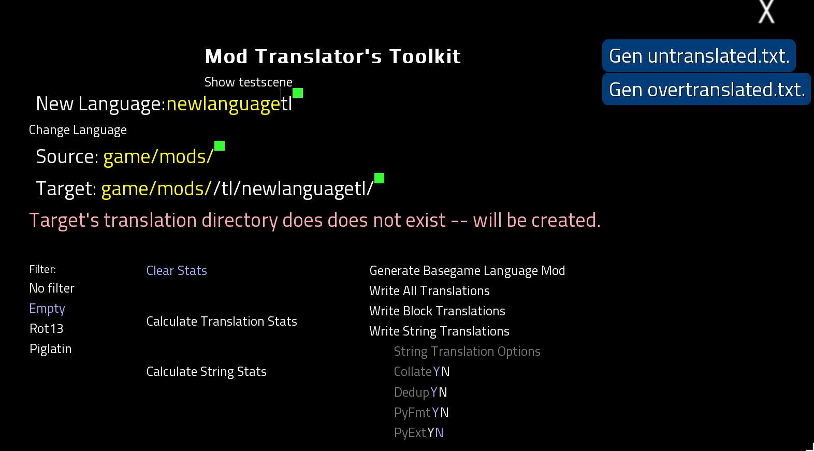

If you're here to translate a mod into a language for which other translations exist, but not of this mod, then you're where you need to be. Otherwise, head back to the [main README](README.md) and follow the appropriate link.

## How do I translate a mod into a new language?

First, install the Translator's Toolkit and whatever you need to be able to select the language you want to translate into. For example, for a mod you're translating to French, install the French translation mod for the base game.

Then, launch the game and choose your target language. On the main menu you'll find a new "Mod Translation" button, dead-center. Click it. That will take you to the translation menu shown below:

Don't panic! This menu is built out of a few simple parts. For now, we just need to adjust your "Source" and "Target" paths.

The "Source" path should point to the root of the mod you're translating, and the "Target" path should point to the `resource` directory of the translation mod you're creating. Click on the yellow part of the text box and, _while hovering over the text_, replace the path with the correct one. The square next to the Source should glow green both before and after you're done, though it may turn red while you're typing. It's okay if the square next to the Target is red; it's just a warning that the directory doesn't exist yet, as the text below will explain.

Next, we'll look at the buttons on the left, labeled "Filter." Different translators want to see different things in place of untranslated text lines when they're working, and these filters let you set what you'll see in-game. (Untranslated text lines in the text file will always be shown plain, regardless of this setting.)

The filters available as of this writing are:

* No Filter - Uses the original English text for all translation lines until you replace them with the target language.

* Blank - Uses a blank line for all translation lines until you fill them in with the target language.

* Rot13 - Uses the original English text, but ROT13-encodes it to make it appear as properly-sized gibberish until replaced with the target language translation.

* Pig Latin - Uses the original English text, but translates it into Pig Latin to make it appear as oversized gibberish until replaced with the target language translation.

Choose the filter you prefer with a click.

If you'd like to get an idea of your progress, you can click the "Calculate Translation Stats" button to see how many character-spoken text lines have been translated, and the "Calculate String Stats" button to see how many menu and interface text lines have been translated. These stats are based on the game's current language setting, so you can come back to this menu at any time to check. (Note you can also adjust the "Source" field to narrow the stats to just a single mod or part of the game.)

Finally, to create the translation files for the mod you're translating, click "Write All Translations" on the right. This will create the translation files for the mod you're translating at the target path you specified. You can then crack these files open and start translating!

## Advanced Options

You may have noticed the "String Translation Options" in the lower right corner of the menu. These options let you adjust the format of menu options and interface lines to better fit your needs. The options available as of this writing are:

* `Collate` (Default: Y): Collects all strings across all files into a single `strings` file. This is useful for translators who want to leave the UI text untranslated and focus on the character-spoken text, or to be able to focus on the UI-like text in one go.

* `Dedup` (Default: Y): Hides duplicate strings across _all_ files. This is useful in general to prevent duplication of work, but it's also near-mandatory if you use the Ren'Py translation format instead of the toolkit's python format, as Ren'Py will crash if it finds duplicate strings. If `Collate` is not enabled, then locations of a string outside the first file it appears in will be lost.

* `PyFmt` (Default: Y): Uses the toolkit's python format for translation files. This format is slightly less human-readable than Ren'Py's format, but it's more flexible for people who want to work with the files programmatically both inside and outside the engine. If you're not sure which format to use, I recommend leaving this on.

* `PyExt` (Default: N): Exports the strings file as `strings.py` instead of `strings.rpy`. This disables automatic loading of the strings file in Ren'Py, but it's useful for people who want to incorporate the strings file into a mod's load order.

If the mod you're translating has been updated with new text lines, just set up the "Source" and "Target" paths as you did before and click "Write All Translations" again. This will update the translation files with the new text lines without affecting any lines already translated.

